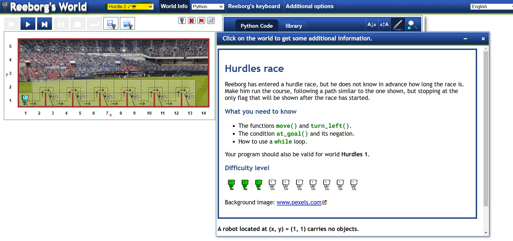
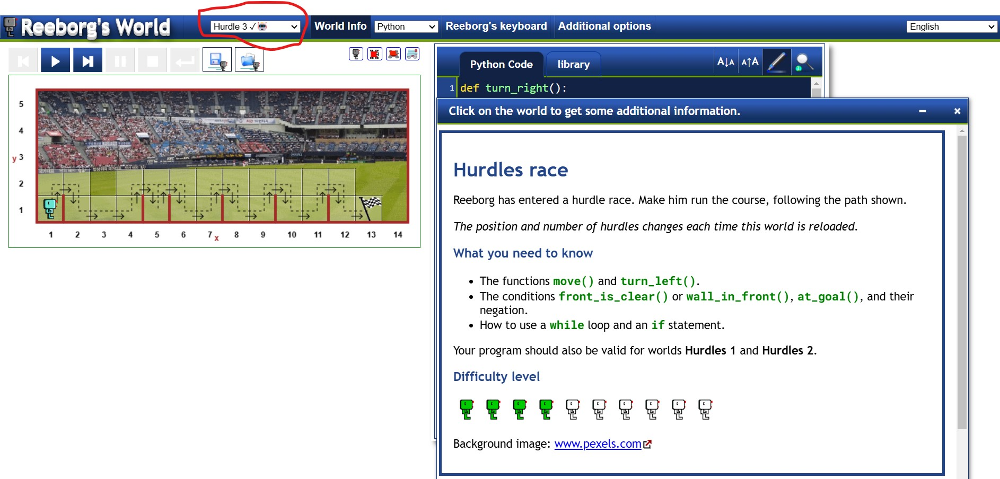

## Function
- A function is a block of code that performs a specific task.
- functions are used to reusable code.

```python
# Defintion of the function

def function_name():
    #Do this task
    #Then execute this code
    #Finally do this

# Calling the function
 function_name()

```
- There are some python [built in functions](https://docs.python.org/3/library/functions.html)

## Indentation
- Indentation refers to the spaces at the beginning of a code line.Where in other programming languages the indentation in code is for readability only, the indentation in Python is very important.Python uses indentation to indicate a block of code.
- For indetation we can use 4 ```Spaces``` or single ```Tab``` sapce
- Official document reference for [style guide for python code](https://peps.python.org/pep-0008/#code-lay-out)

## While Loop
- With the ```while``` loop we can execute a set of statements as long as a condition is true.
```python
while condition_is_true:
    #do this task
```

##### Reeborg's world hurdle2 challenge reference
- [reeborgs_world.py](reeborgs_world.py)
- [Click Here](https://reeborg.ca/reeborg.html?lang=en&mode=python&menu=worlds%2Fmenus%2Freeborg_intro_en.json&name=Hurdle%202&url=worlds%2Ftutorial_en%2Fhurdle2.json) for reeborg's hurdle2 challenge
 
 

 ##### Reeborg's world hurdle3 challenge reference
 - [Reeborgs world hurdle3](reebogers_world_hurdle3.py)
 - [Click Here](https://reeborg.ca/reeborg.html?lang=en&mode=python&menu=worlds%2Fmenus%2Freeborg_intro_en.json&name=Hurdle%203&url=worlds%2Ftutorial_en%2Fhurdle3.json) for reeborg's hurdle3 challenge.


- Reeborg's world hurdle3 challenge reference image
 - 

##### Reeborg's world hurdle4 challenge reference
-[reeborgs hurdle4](reebogers_world_hurdle4.py)
-[Click Here](https://reeborg.ca/reeborg.html?lang=en&mode=python&menu=worlds%2Fmenus%2Freeborg_intro_en.json&name=Hurdle%204&url=worlds%2Ftutorial_en%2Fhurdle4.json) for challenge of jumping over hurdles with variable heights.

- Reeborg's world hurdle4 challenge reference image
 - 
