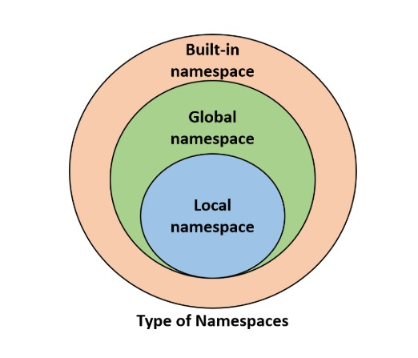

#### Namespaces and Scopes
- Namespaces are collections of different objects that are associated with unique names whose lifespan depends on the scope of a variable
- Types of Namespaces: 


    


- sample code
```python

    # var1 is in the global namespace 
    var1 = 5
    def some_func():
        # var2 is in the local namespace 
        var2 = 6
        def some_inner_func():
            # var3 is in the nested local 
            # namespace
            var3 = 7

```
